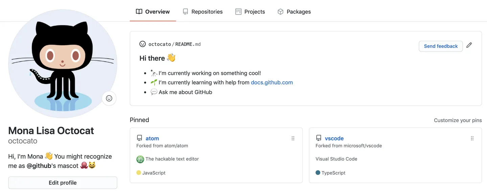
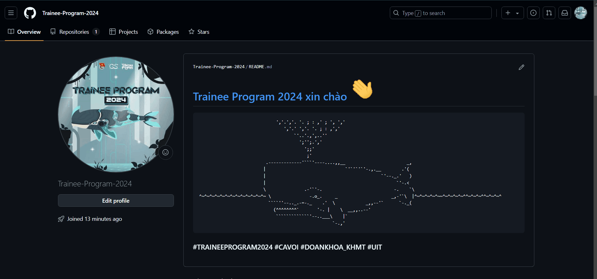

## Tổng kết ✨

> Qua buổi học đầu tiên đầy mới mẻ cùng Cá Voi thì chúng mình đã cùng nhau học được những kiến thức đầy thú vị phải hong nào. Để Cá Voi tóm tắt lại những gì đã học nhé 

- [Record buổi học](https://uithcm.sharepoint.com/:v:/s/TraineeProgram2024/EcGdrtN_rmpOu-mrYZpfVawBhnMkh1_rDqiK8ZPzyd2oMQ?e=u6EwMB)
- [Mardown Languague](https://www.markdownguide.org/cheat-sheet): Mục đích, Công dụng và Một số cú pháp. 
- [Git, GitHub](https://education.github.com/git-cheat-sheet-education.pdf): Khái niệm, mục đích, một số câu lệnh git cơ bản: git init, git branch, git add, git commit, git push,... trên CLI lẫn GitHub Desktop và thực hành commit lên GitHub repository.

## Bài tập về nhà 📗📙📘 [Deadline 23h59 - 08/11/2024]

> Sau khi đã tạo tài khoản GitHub, ngoài cộng tác và làm việc, các bạn có thể trang trí và thỏa sức thể hiện bản thân mình thông qua __GitHub Profile__ như bên dưới (nhất là khi có người khác ghé thăm trang cá nhân của mình :>) 

### hoặc như này 

> Và để làm được điều đó, các bạn cần áp dụng kiến thức về __Markdown Language__ đã được học. Để dễ dàng hơn cho các bạn, Cá Voi có một số nguồn tham khảo như sau
- [GitHub Docs - Nguồn hướng dẫn official từ GitHub](https://docs.github.com/en/account-and-profile/setting-up-and-managing-your-github-profile/customizing-your-profile/about-your-profile)
- [Tool generate GitHub Profile](https://rahuldkjain.github.io/gh-profile-readme-generator/)

## Yêu cầu 🔍
> Nhiệm vụ của các bạn trong bài tập này bao gồm
- Edit GitHub Profile của mình một cách sáng tạo nhất ✨✨✨
- Điền form nộp bài qua [Link này](https://forms.office.com/r/aCMJ1msqw8) trước __deadline (23h59-08/11/2024)__.
- Link tới GitHub Profile của các bạn sẽ được BTC chấm điểm và là 1 phần cực kỳ quan trọng quyết định khả năng đi tiếp của bạn trên hành trình TP24 này.
> Cá Voi xin chân thành cảm ơn sự tham gia nhiệt tình của các bạn và hy vọng các bạn sẽ tạo ra những sản phẩm cực kỳ xịn xò nè!!!

